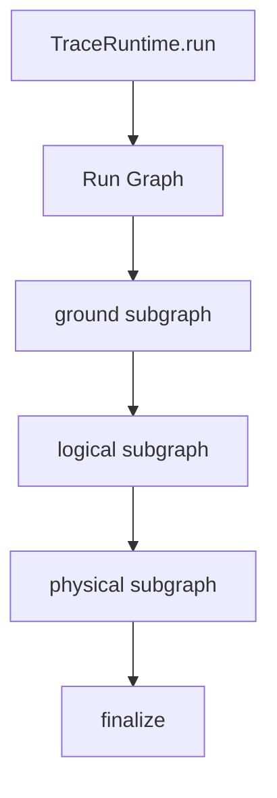
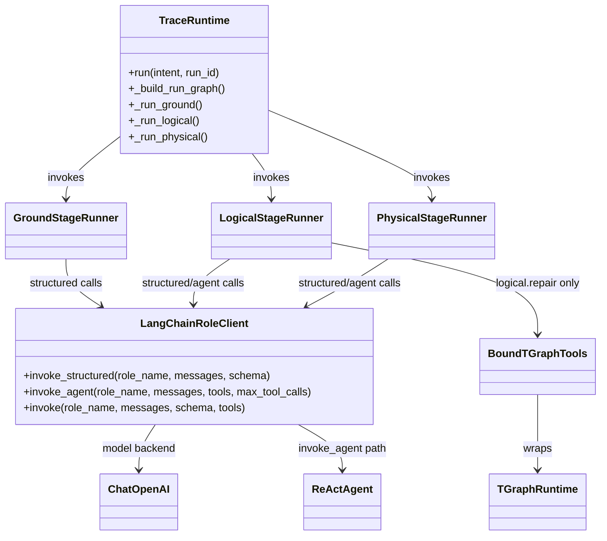

# LangGraph 架构软件说明

本文档描述 TRACE 当前基于 LangGraph 的运行架构，重点说明各 stage 的子图组织方式，以及脚本节点、结构化 LLM 节点、Agent 节点之间的职责边界。

## 1. 运行时分层

- 运行入口：`TraceRuntime.run(...)`
- 顶层运行图：`ground -> logical -> physical -> finalize`
- 每个 stage 都是独立子图，由 `src/trace/stages/<stage>/__init__.py` 组装

## 2. 节点类型约定

- 脚本节点：纯 Python 逻辑，不调用模型
- 结构化 LLM 节点：通过 `role_client.invoke_structured(...)` 返回受 Pydantic schema 约束的完整对象
- Agent 节点：通过 `role_client.invoke_agent(...)` + tools 驱动 ReAct Agent 做局部查询与修改

## 3. 顶层与子图结构

```mermaid
flowchart TD
    subgraph Ground
        g_prepare["prepare<br/>脚本"]
        g_author["author<br/>LLM"]
        g_eval["evaluator<br/>LLM"]
        g_finalize["finalize<br/>脚本"]
        g_prepare --> g_author --> g_eval
        g_eval -->|通过| g_finalize
        g_eval -->|不通过且未超限| g_author
    end

    subgraph Logical
        l_prepare["prepare<br/>脚本"]
        l_author["author<br/>LLM"]
        l_builder["builder<br/>LLM"]
        l_validator["validator<br/>脚本"]
        l_repair["repair<br/>Agent + TGraph Tools"]
        l_finalize["finalize<br/>脚本"]
        l_prepare --> l_author --> l_builder --> l_validator
        l_validator -->|通过| l_finalize
        l_validator -->|失败且可修复| l_repair --> l_validator
    end

    subgraph Physical
        p_prepare["prepare<br/>脚本"]
        p_author["author<br/>LLM"]
        p_builder["builder<br/>LLM"]
        p_validator["validator<br/>脚本"]
        p_repair["repair<br/>Agent + TGraph Tools"]
        p_finalize["finalize<br/>脚本"]
        p_prepare --> p_author --> p_builder --> p_validator
        p_validator -->|通过| p_finalize
        p_validator -->|失败且可修复| p_repair --> p_validator
    end
```

## 4. 当前实现中的关键职责边界

- `ground` 负责把用户意图整理成 `GroundArtifact`
- `ground.evaluator` 的结果会经过 Python 后处理后再决定是否回到 `author`
- `logical.prepare` 只根据 `node_groups` 生成空骨架：有 nodes，但初始 `ports=[]`、`links=[]`
- `logical.builder` 不是工具式补图节点，它先由代码根据 `logical_constraints` 预补 topology，再调用结构化 LLM
- `logical.repair` 才是当前唯一使用 `BoundTGraphTools` 做局部图修改的节点
- `physical.prepare` 直接从 `logical_artifact.tgraph_logical` 复制出 `tgraph_physical` 的初始工作图，只切换 profile
- `physical.builder` 是结构化 LLM 节点，返回完整 `PhysicalArtifact`；`physical.repair` 现在与 `logical.repair` 一样，走 `Agent + TGraph tools` 的局部 artifact repair
- `physical.validator` 现在不会再因为 authored F4 失败而直接 `failed`，而是把这类问题也交给 `physical.repair` 处理；只有超过最大尝试次数时才失败

## 5. Builder 与 Repair 的当前分工

### Logical builder

- 输入 `working_graph` 来自 `prepare`
- 进入 LLM 之前，会先执行 `apply_logical_constraints(...)`
- 这一步会根据 grounded `logical_constraints` 直接补：
  - 缺失 ports
  - 缺失 links
  - 一套初始 addressing seed
- 若代码已补出 links，则 builder 进入 `addressing_only` 模式：
  - LLM 仍返回完整 `LogicalArtifact`
  - 但代码最终只合并 `ip/cidr`
  - topology 以代码生成的 `seeded_graph` 为准
- 若代码未补出 links，则 builder 进入 `full_builder` 模式：
  - LLM 返回的完整 `tgraph_logical` 会整体作为候选结果

### Physical builder

- 不使用 mutation tools
- 直接基于 `working_graph`、`ground_artifact`、`physical_checkpoints` 调结构化 LLM
- LLM 返回完整 `PhysicalArtifact`
- 代码对 `tgraph_physical` 做标准化后写回 state
- validator 再检查是否破坏了 logical graph 的 node ids / link ids

### Repair

- `logical.repair`：Agent + TGraph tools，做局部修图、局部修 checkpoint / validator script
- `physical.repair`：Agent + TGraph tools，做局部 physical artifact 修复，包括 graph / checkpoints / validator script

## 6. 关键组件 UML

## 7. 相关文档

- Ground：`docs/architecture/langgraph/ground/README.zh.md`
- Logical：`docs/architecture/langgraph/logical/README.zh.md`
- Physical：`docs/architecture/langgraph/physical/README.zh.md`
