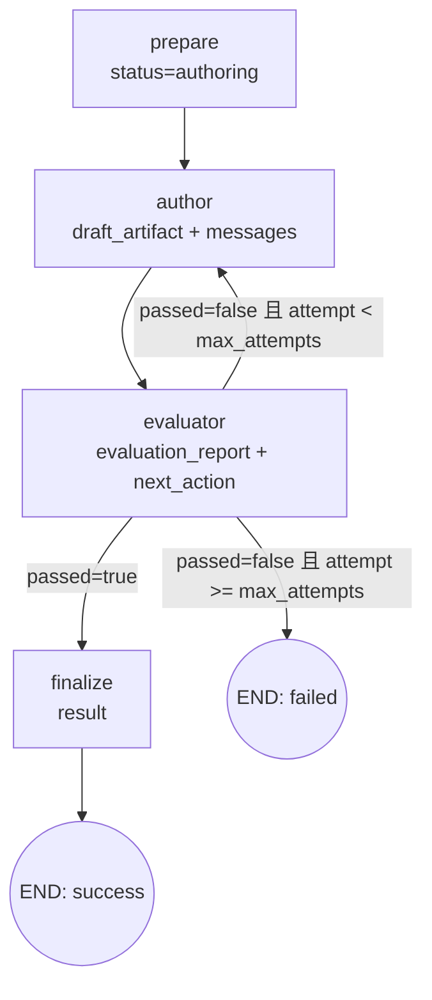
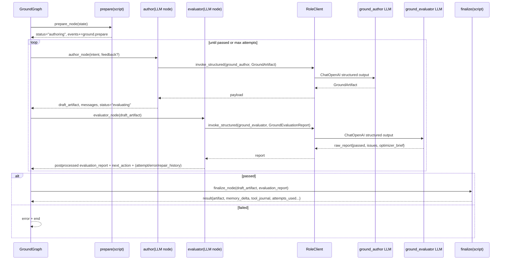

# Ground Stage 软件说明

## 1. 目标

Ground stage 负责把用户意图转成 `GroundArtifact`，并通过 `author -> evaluator` 循环迭代，直到评估通过或超过重试上限。

## 2. Stage 输入/输出合约

| 项目 | 内容 |
| --- | --- |
| 输入（来自 Runtime） | `intent`、`attempt=1`、`max_attempts=settings.roles["ground_evaluator"].max_attempts`、`status="preparing"`、`repair_history=[]`、`events=[]` |
| 输出（返回 Runtime） | `result` 字段，包含 `artifact`、`memory_delta`、`attempts_used`、`evaluation_summary`、`messages`、`tool_journal`、`repair_history`、`events` |
| `artifact` 结构 | `GroundArtifact`：`node_groups`、`logical_constraints`、`physical_constraints` |
| 失败出口 | 当 `attempt >= max_attempts` 且仍未通过，设置 `error` 并走 `next_action="failed"` 结束 |

## 3. 节点级职责与数据交接

| 节点 | 类型 | 读取的关键 state 字段 | 主要处理 | 写回/传给下一步的数据 |
| --- | --- | --- | --- | --- |
| `prepare` | 脚本 | `events` | 设置阶段状态 | 写回 `status="authoring"`、追加 `events += ground.prepare` |
| `author` | LLM | `intent`、`evaluation_report`、`draft_artifact` | 调 `ground_author` 结构化生成或修订 `GroundArtifact`；若 evaluator 给过反馈，则把 `evaluation_feedback` 和 `previous_artifact` 一并注入 | 写回 `messages`、`draft_artifact`、`status="evaluating"`、`events += ground.author.completed` |
| `evaluator` | LLM + 后处理脚本 | `draft_artifact`、`attempt`、`max_attempts` | 调 `ground_evaluator` 输出 `GroundEvaluationReport`，再做 `_postprocess_ground_report(...)`，并据此判定路由 | 写回 `messages`、`evaluation_report`、`grounding_checks`、`next_action`；失败时写 `error`；可重试时写 `repair_history` 并 `attempt += 1` |
| `finalize` | 脚本 | `draft_artifact`、`attempt`、`evaluation_report`、`messages`、`repair_history`、`events` | 用 `GroundArtifact.model_validate` 做最终校验并封装结果 | 写回 `result`（`stage_id=ground`、`artifact`、`memory_delta={}`、`tool_journal=[]` 等），供 Runtime 合并 |

## 4. 当前实现中的评估后处理

`ground.evaluator` 不是单纯把模型输出原样透传给后续节点。当前实现会在 LLM 输出后执行 `_postprocess_ground_report(...)`，主要包括：

- 过滤可忽略的 “缺少 physical constraints” 类问题
- 规范化 `optimizer_brief`
- 重新计算 `passed`
- 在无 issue 时强制视为通过

因此 ground stage 的真实语义是：

1. LLM 先给出原始评估报告
2. Python 后处理再决定最终 `evaluation_report`
3. 图根据后处理后的 `report` 决定是否回到 `author`

## 5. 条件路由与字段变化

## 6. UML 时序图（含数据字段）

