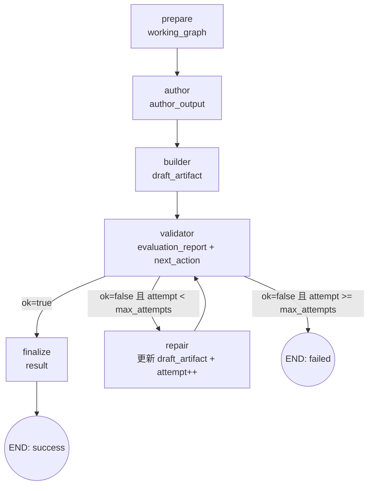
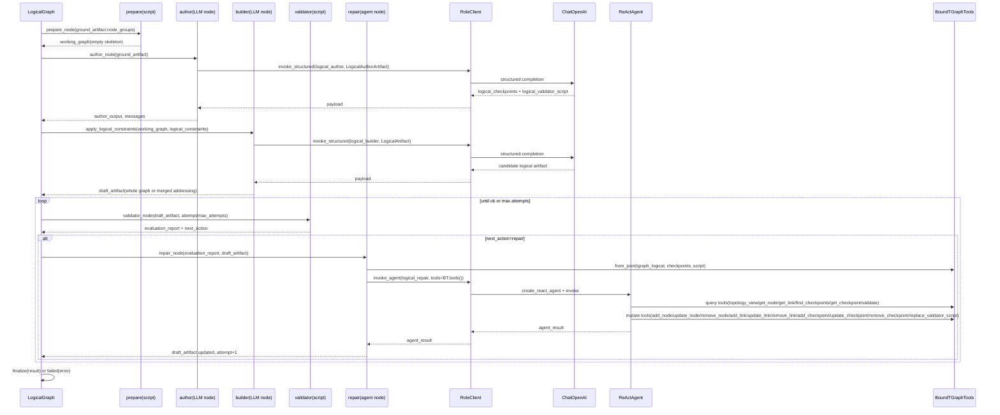

# Logical Stage 软件说明

## 1. 目标

Logical stage 基于 `ground_artifact` 生成 `tgraph_logical`，并通过 `validator -> repair` 循环修复，直到满足逻辑层校验约束。

当前实现里，logical stage 不是“从零完全交给 LLM 画图”，而是分成两段：

1. `prepare` 生成空 skeleton
2. `builder` 先由代码按 grounded `logical_constraints` 预补 topology，再由 LLM 完成整图或地址补全

## 2. Stage 输入/输出合约

| 项目 | 内容 |
| --- | --- |
| 输入（来自 Runtime） | `ground_artifact`、`attempt=1`、`max_attempts=settings.roles["logical_repair"].max_attempts`、`repair_history=[]`、`events=[]` |
| 输出（返回 Runtime） | `result` 字段，包含 `artifact`、`memory_delta`、`attempts_used`、`evaluation_summary`、`messages`、`tool_journal`、`repair_history`、`events` |
| `artifact` 结构 | `LogicalArtifact`：`logical_checkpoints` + `logical_validator_script` + `tgraph_logical` |
| 失败出口 | `validator` 在 `attempt >= max_attempts` 且 `ok=false` 时设置 `error`，`next_action="failed"` |

## 3. 节点级职责与数据交接

| 节点 | 类型 | 读取的关键 state 字段 | 主要处理 | 写回/传给下一步的数据 |
| --- | --- | --- | --- | --- |
| `prepare` | 脚本 | `ground_artifact.node_groups`、`events` | `expand_node_groups -> build_logical_skeleton`，只生成空节点骨架 | 写回 `working_graph`、`events += logical.prepare` |
| `author` | LLM | `ground_artifact` | 调 `logical_author` 生成 `logical_checkpoints` 与 `logical_validator_script` | 写回 `author_output`、`messages`、`events += logical.author.completed` |
| `builder` | LLM + 脚本前后处理 | `ground_artifact`、`working_graph` | 先对 `working_graph` 执行 `apply_logical_constraints(...)`，再调 `logical_builder` 生成 `LogicalArtifact`，最后按 mode 决定整体采纳还是只合并 addressing | 写回 `draft_artifact={tgraph_logical,logical_checkpoints,logical_validator_script}`、`working_graph=seeded_graph`、`messages`、`events += logical.builder.completed` |
| `validator` | 脚本 | `draft_artifact.tgraph_logical`、`draft_artifact.logical_checkpoints`、`draft_artifact.logical_validator_script`、`attempt`、`max_attempts` | 运行默认校验 + 当前 authored F4 校验，生成 `evaluation_report` 并路由 | 写回 `evaluation_report`、`next_action`；失败时写 `error` |
| `repair` | Agent | `draft_artifact`、`evaluation_report`、`repair_history`、`ground_artifact.logical_constraints` | 绑定 `BoundTGraphTools`，用 ReAct Agent 做局部查询与修改，并回写完整 logical artifact | 写回更新后的 `draft_artifact`、`messages`、`attempt += 1`、`repair_history`、`events += logical.repair.completed` |
| `finalize` | 脚本 | `draft_artifact`、`attempt`、`evaluation_report`、`messages`、`repair_history`、`events` | `LogicalArtifact.model_validate` 并封装 stage 结果 | 写回 `result` |

## 4. Skeleton 与 Link 生成的当前实现

### 4.1 `prepare` 只生成空 skeleton

`prepare_node` 当前只做两步：

1. `expand_node_groups(...)`
2. `build_logical_skeleton(...)`

生成结果特点：

- `nodes` 已经存在
- 每个 node 的 `ports=[]`
- `links=[]`
- `image=None`
- `flavor=None`

也就是说，`prepare` 本身不会补 link。

### 4.2 进入 builder 前，代码会先补 topology

`logical.builder` 开头会调用：

- `apply_logical_constraints(working_graph, logical_constraints)`

这一步会从 grounded natural-language constraints 中提取 node pair，然后由代码直接补：

- 缺失 ports
- 缺失 links
- 一套初始 `ip/cidr` seed

因此，准确说法是：

- `prepare` 不补 link
- `builder` 调 LLM 之前的脚本预处理会补 link

## 5. Builder 的两种模式

`logical.builder` 会根据 `apply_logical_constraints(...)` 的结果选择两种模式。

### 5.1 `full_builder`

触发条件：

- `applied_links == 0`

行为：

- 将 `working_graph` 和 grounded constraints 交给 `logical_builder`
- LLM 返回完整 `LogicalArtifact`
- 代码整体采纳 LLM 返回的 `tgraph_logical`

适用场景：

- 代码预处理无法从当前 constraints 中稳定抽出 topology

### 5.2 `addressing_only`

触发条件：

- `applied_links > 0`

行为：

- 将代码生成的 `seeded_graph` 视为 canonical topology skeleton
- LLM 仍返回完整 `LogicalArtifact`
- 但代码不会采纳 LLM 重新画出的 topology
- 只通过 `merge_port_addressing(...)` 把 `ip/cidr` 合并回 `seeded_graph`

适用场景：

- 代码已根据 grounded constraints 补出了 topology
- LLM 只负责 refining addressing

### 5.3 实现含义

所以当前 `logical builder` 不是：

- 纯全量重生成
- 也不是 tool-based patch

而是：

1. 空 skeleton
2. 代码预补 topology
3. LLM 返回完整结构化 artifact
4. 代码按 mode 决定“采整图”还是“只采 addressing”

## 6. Repair 的当前实现

`logical.repair` 是当前三阶段中唯一 Agent 节点。

它的工作方式是：

1. 用 `draft_artifact.tgraph_logical` + authored F4 artifacts 构造 `BoundTGraphTools`
2. 把 `evaluation_report`、`logical_constraints`、candidate checkpoints、recent repair ledger 注入 prompt
3. 调 `role_client.invoke_agent(...)`
4. 由 ReAct Agent 调工具做局部查询和局部修改
5. 通过 `bound_tools.artifact_state()` 回写：
   - `tgraph_logical`
   - `logical_checkpoints`
   - `logical_validator_script`

这意味着 repair 的对象已经是“完整 logical artifact”，不只是 graph。

## 7. 数据路由与状态变化

## 8. UML 时序图

## 9. 关键实现点

- `logical.prepare` 只负责 node skeleton，不负责 topology completion
- grounded `logical_constraints` 是 builder 的主要 realization 输入
- authored `logical_checkpoints` 是 F4 校验输入，不是 builder 的主真值来源
- `logical.builder` 当前不是 tool-driven patch node
- `logical.repair` 负责裁决 graph / checkpoint / validator script 之间的冲突
