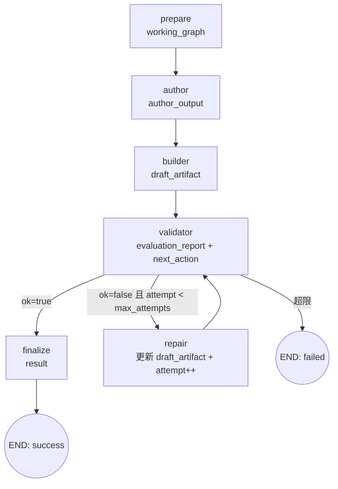
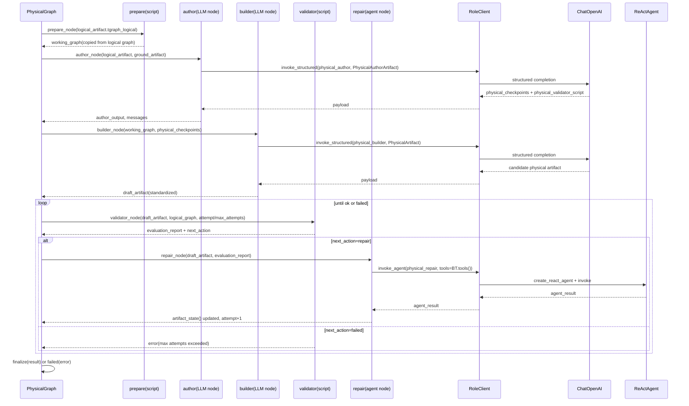

# Physical Stage 架构说明

## 1. 目标

Physical stage 在 logical 拓扑基础上补充部署字段，例如：

- `image`
- `flavor`
- 其他 physical metadata

同时保证物理图不会改变 logical 层已经确定的：

- node ids
- link ids
- logical topology identity

## 2. Stage 输入/输出契约

| 项目 | 内容 |
| --- | --- |
| 输入（来自 Runtime） | `logical_artifact`、`ground_artifact`、`attempt=1`、`max_attempts=settings.roles["physical_repair"].max_attempts`、`repair_history=[]`、`events=[]` |
| 输出（返回 Runtime） | `result` 字段，包含 `artifact`、`memory_delta`、`attempts_used`、`evaluation_summary`、`messages`、`tool_journal`、`repair_history`、`events` |
| `artifact` 结构 | `PhysicalArtifact`：`physical_checkpoints` + `physical_validator_script` + `tgraph_physical` |
| 失败出口 | `validator` 在 `attempt >= max_attempts` 且 `ok=false` 时设置 `error`，`next_action="failed"` |

## 3. 节点级职责与数据交接

| 节点 | 类型 | 读取的关键 state 字段 | 主要处理 | 写回/传给下一步的数据 |
| --- | --- | --- | --- | --- |
| `prepare` | 脚本 | `logical_artifact.tgraph_logical`、`events` | `build_physical_graph(...)` 从 logical graph 复制出 physical 初始工作图，并切换 profile | 写回 `working_graph`、`events += physical.prepare` |
| `author` | LLM | `logical_artifact`、`ground_artifact` | 调 `physical_author` 生成 `physical_checkpoints` 和 `physical_validator_script` | 写回 `author_output`、`messages`、`events += physical.author.completed` |
| `builder` | LLM | `logical_artifact`、`ground_artifact`、`working_graph`、`author_output.physical_checkpoints` | 调 `physical_builder` 返回完整 `PhysicalArtifact`，再标准化 `tgraph_physical` | 写回 `draft_artifact={physical_checkpoints,physical_validator_script,tgraph_physical}`、`messages`、`events += physical.builder.completed` |
| `validator` | 脚本 | `draft_artifact`、`logical_artifact.tgraph_logical`、`attempt`、`max_attempts` | 运行默认 physical validators，并额外检查 logical/physical 身份一致性与 F4 authored checks | 写回 `evaluation_report`、`next_action`；超限失败时写 `error` |
| `repair` | Agent + TGraph tools | `draft_artifact`、`evaluation_report`、`logical_artifact`、`ground_artifact`、`attempt`、`repair_history` | 调 `physical_repair`，通过低层 TGraph tools 做局部 artifact repair | 写回修复后的 `draft_artifact`、`messages`、`attempt += 1`、`repair_history`、`events += physical.repair.completed` |
| `finalize` | 脚本 | `draft_artifact`、`attempt`、`evaluation_report`、`messages`、`repair_history`、`events` | `PhysicalArtifact.model_validate` 并封装结果 | 写回 `result` |

## 4. Prepare 与 Builder 的当前实现

### 4.1 `prepare` 不是重新推导 physical topology

`physical.prepare` 当前非常直接：

- 输入：`logical_artifact.tgraph_logical`
- 处理：`build_physical_graph(logical_graph)`
- 输出：复制后的 `working_graph`

它不会：

- 新增 node
- 删除 node
- 改写 link
- 重新布线

它只是把 logical graph 复制成 physical stage 的起始工作图，并把 `profile` 切到 physical profile。

### 4.2 `physical.builder` 仍然是整体 artifact 生成

当前 `physical.builder`：

- 不使用 mutation tools
- 直接调用结构化 LLM
- 返回完整 `PhysicalArtifact`

但它不是“任意重画物理图”。它的约束是：

- 必须保持 logical topology
- 只能做 deployment enrichment
- 主要补 `image` / `flavor` / 其他 canonical physical fields

所以它的实际语义更接近：

- “整体生成完整 physical artifact”
- 但“逻辑拓扑不可改”

## 5. Validator 的一致性规则

`_validate_physical_artifact(...)` 在默认校验之外，还会追加两条硬约束：

1. `sorted(physical_link_ids) == sorted(logical_link_ids)`
2. `sorted(physical_node_ids) == sorted(logical_node_ids)`

如果不满足，会追加错误：

- `physical_links_changed`
- `physical_node_ids_changed`

这意味着：

- physical stage 可以补字段
- 但不能改 logical stage 已经确定的节点身份和链路身份

## 6. Authored F4 失败的当前处理

physical stage 现在不再把 authored F4 失败直接终止掉。

如果 validator 发现 physical 的 authored F4 checks 失败：

- issue 会保留在 `evaluation_report`
- `next_action` 会继续指向 `repair`
- `physical.repair` 可以直接修改 graph、`physical_checkpoints`、`physical_validator_script`

也就是说，physical stage 现在和 logical stage 一样，把 authored checks 也纳入 artifact repair 范围。

## 7. Repair 的当前实现

`physical.repair` 现在和 `logical.repair` 一样，是 `Agent + TGraph tools`。

它的行为是：

1. 把 `evaluation_report`、`logical_topology`、`physical_constraints`、候选 checkpoints、repair ledger 注入 prompt
2. 调 `invoke_agent(physical_repair, tools=BoundTGraphTools.tools())`
3. 通过工具局部修改：
   - `tgraph_physical`
   - `physical_checkpoints`
   - `physical_validator_script`
4. 把 `artifact_state()` 回写到 `draft_artifact`
5. 再跑一轮 physical validator 生成 repair ledger

因此它的当前语义是：

- “工具驱动的局部 physical artifact repair”

而不是：

- “结构化 LLM 对完整 physical artifact 做整体重写”

## 8. 数据路由与状态变化

## 9. UML 时序图

## 10. 与 Logical Stage 的关键差异

- `logical.prepare` 产出空 skeleton；`physical.prepare` 直接复制 logical graph
- `logical.builder` 有“代码预补 topology + LLM 补整图 / 补地址”的双阶段语义；`physical.builder` 仍然直接整体生成 `PhysicalArtifact`
- `logical.repair` 和 `physical.repair` 现在都是 `Agent + TGraph tools`
- 两者都可以修改 graph / checkpoints / validator script，只是 `physical.repair` 额外受“必须保持 logical topology identity”的 validator 约束
